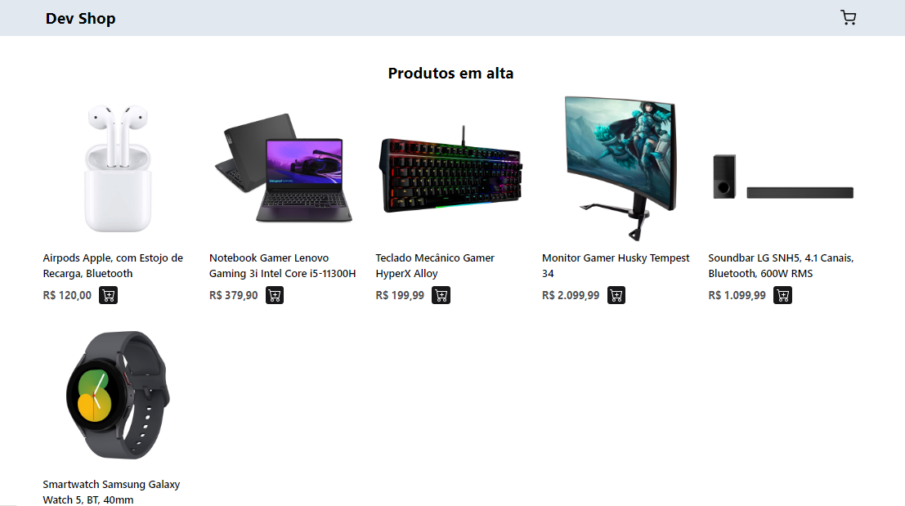

<hr>

### Tópicos

- [Descrição do projeto](#descrição-do-projeto)

- [Funcionalidades](#funcionalidades)

- [Layout](#layout)

- [Ferramentas utilizadas](#ferramentas-utilizadas)

- [Acesso ao projeto](#acesso-ao-projeto)

- [Abrir e rodar o projeto](#abrir-e-rodar-o-projeto)

- [Desenvolvedor](#desenvolvedor)

## Descrição do projeto

<p align="justify">
  Projeto desenvolvido focando na lógica de um site e-commerce, fazendo toda a movimentação de adicionar itens ao carrinho, alterar sua quantidade, deletar itens, e calcular o valor total da compra. Também traz o produto com mais detalhes ao ser clicado.

  Faz o preenchimento dinâmico da lista de produtos na página principal, através do consumo de uma API fake, simulando uma API do Back-End.
 


</p>

## Funcionalidades

:heavy_check_mark: `Funcionalidade 1:` Exposição de produtos na página home.

:heavy_check_mark: `Funcionalidade 2:` Ao clicar no produto, é levado a página que o traz em detalhes.

:heavy_check_mark: `Funcionalidade 3:` Página do carrinho, com toda a lógica para aumentar ou diminuir a quantidade de cada produto adicionado, e o valor sub total de cada produto.

:heavy_check_mark: `Funcionalidade 4:` Traz o valor total de todos os produtos adicionados no carrinho.

## Layout

<div align="center">


### Layout Responsivo

      

  </div>

###

## Ferramentas utilizadas

       

- React
- TypeScript
- JavaScript
- HTML
- Git
- TailwindCSS

🎈 <i><b>OBS:</b></i> 

O consumo da API fake foi feito através da biblioteca typicode/json-server, simulando uma API do Bck-End.

Foi usado o ContextAPI para gerenciar os estados do carrinho, permitindo que se tenha acesso aos seus dados de uma forma global, podendo ser usado em qualquer página ou componente em que se faça uso do mesmo. Ainda no React foi feito uso da biblioteca react-hot-toast, para fornecer um feedback as ações dos usuários, proporcionando uma melhor experiência durante seu uso. Podendo também, ser aplicado as notificações geradas, um estilo e um comportamento personalizado.

Para fazer o estilo do projeto, foi utilizado o TailwindCSS. Por se tratar de um projeto de estudo, o foco foi mantido na parte lógica de um e-commerce, e o TailwindCSS nos facilita, tornando mais ágil o processo de estilização, visto que não é uma aplicação grande e complexa.

###

## Acesso ao projeto

Você pode <a href="https://e-commerce-cart-two.vercel.app/" target="_blank">acessar o site do projeto.</a>

🎈 <i><b>OBS:</b></i> 

Para uma melhor visualização do projeto, o aconselhado é que seja rodado através da porta local gerada pelo Vite, usando o terminal através do ```npm run dev``` ("http://localhost:5173/"), e em um segundo terminal seja rodado a API fake ```json-server --watch db.json```, para fazer o preenchimento do projeto com os produtos trazidos pela API.

## Abrir e rodar o projeto

```cmd
# Clone este repositório
git clone <link do repositório>

# Acesse a pasta do projeto no seu terminal
cd dinamic_linktree

# Execute a aplicação
npm run dev

# Abra um segundo terminal para rodar a API, mas sem interromper o primeiro que roda o projeto
json-server --watch db.json
```

## Desenvolvedor

[<br><sub>Bruno Dias de Freitas</sub>](https://www.linkedin.com/in/brunodias-dev)
